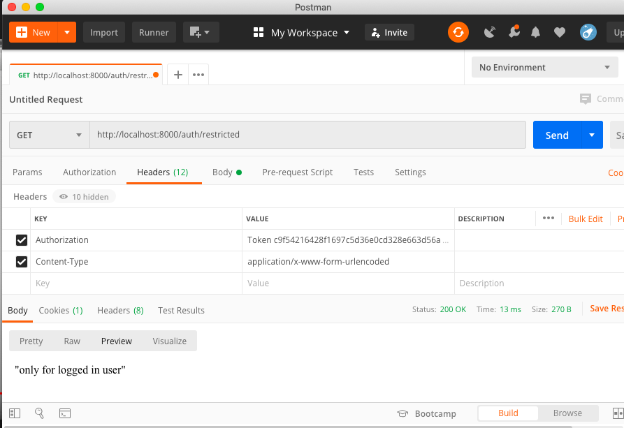

# django auth

A basic Django backend which lets user login,logout and signup and save data in SQLite database. User authorization is also implemented.


### How to Run?

#### PreRequisites
  * [Python ~3.7](https://www.python.org/)
  
#### Important **pip** packages used in this app
  * [django](https://pypi.org/project/Django/)
  * [djoser](https://pypi.org/project/djoser/0.4.1/)
  * [django-rest-frameworlk](https://pypi.org/project/django-rest-framework/)

  
#### Setup Project:
#####  1. Clone or Download the project and `cd` into the `django-auth/` folder.

#####  2. Upgrade pip
   ```
   $ python3 -m pip install --user --upgrade pip
   ```

#####  3. Install virtualenv
  - On macOS and Linux:
  ```
  $ python3 -m pip install --user virtualenv
  ```

  - On Windows:
  ```
  py -m pip install --user virtualenv
  ```
  
  
##### 4. Creating a virtual environment
 - On macOS and Linux:
 
 ```
 python3 -m venv env
 ```
 
 -On Windows:
 ```
 py -m venv env
 ```
#####  5. Commands to activate virtual env:

  - On macOS and Linux:
  ```
  $ source env/bin/activate
  ```

  - On Windows:
  ```
  .\env\Scripts\activate
  ```

#####  6. Install dependencies:
  ```
  $ pip install -r requirements.txt
  ```

#### Launch Project
#####  1. run the app using command:
  ```
  $ python manage.py runserver
  ```
#### Instructions
##### 1. for login

```
$curl -X POST http://127.0.0.1:8000/auth/token/login/ --data 'email=my@email.com&password=my_password'
```
or  

```
http://localhost:8000/auth/token/login
```
**COPY THE TOKEN**

##### 2. for signup
```
$ curl -X POST http://127.0.0.1:8000/auth/users/ --data 'username=MYCOOLUSERNAME&password=my_password&re_password=my_password&first_name=Harsh&last_name=Sahu&email=my@email.com'

```
OR
```
http://localhost:8000/auth/users/
```
##### 3. Visit authorised route
```
curl -LX GET http://127.0.0.1:8000/auth/restricted/ -H 'Authorization: Token <YOUR TOKEN HERE>'
```
OR
after use postman and follow the following screenshot



**if it says `only for logged in user` it means you're logged in successfully!**

##### 4. Logout
```
curl -X POST http://127.0.0.1:8000/auth/token/logout/ -H 'Authorization: Token <YOUR TOKEN HERE>'
```

### If you're running into issues:
contact me on [twitter](https://www.twitter.com/harshsahu97/)
